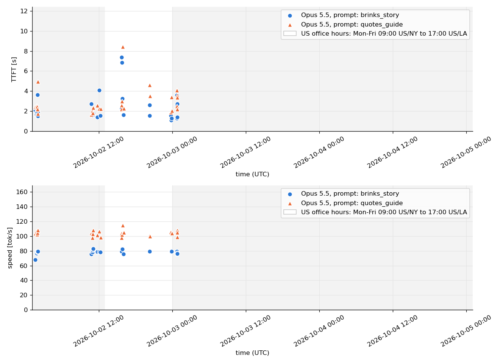

# llm_speedtest

Measures the response speed of LLMs: time to first token (TTFT) and output tok/s. Each run sends
two fixed prompts (with a random prefix for cache avoidance) to the model through `claude -p` and
appends one CSV row per prompt. A second script plots the results over time.

## Example Plot

[](../../raw/main/llm_speedtest_plot.png)

## Requirements

- Python 3.9 or newer
- [Claude Code](https://claude.com/claude-code), with the `claude` command on the `PATH` and
  logged in
- [matplotlib](https://matplotlib.org/), only for the plot script

## Usage

Run a measurement:

```sh
./llm_speedtest.py
./llm_speedtest.py --model claude-sonnet-5-5
```

The script runs the prompts `brinks_story` (a story of about 1000 words) and `quotes_guide` (a
tutorial of about 1000 words in LaTeX syntax) one after the other. It prints each prompt, each
response and a short speed summary, and appends the measurements to `llm_speedtest_results.csv`
next to the script.

Each prompt gets a prepended line with 4 words picked at random from `common_words.txt`, so that
no two runs send the same prompt and no response comes from a cache.

Plot the results:

```sh
pip install matplotlib
./plot_results.py
```

This writes `llm_speedtest_plot.png` next to the script, with three diagrams above each other:
TTFT, decode speed and wall duration, one color and marker shape per model and prompt.
`--no-wall-duration` leaves out the wall duration diagram, and `--model <model ID>` plots only one
model. A white background marks US office hours (Mon-Fri, 09:00 US Eastern time to 17:00 US
Pacific time), and a grey background marks all other times.

## CSV columns

| Column | Meaning |
| ------ | ------- |
| `timestamp_utc` | time the measurement ended, UTC |
| `model` | model(s) reported by Claude Code, separated by `;` |
| `prompt_name` | name of the prompt |
| `ttft_s` | time to first token in seconds |
| `duration_s` | total duration in seconds |
| `duration_api_s` | time spent in API calls in seconds |
| `wall_duration_s` | wall-clock duration of the `claude` process in seconds, measured by the script; empty in rows from before this column existed |
| `output_tokens` | all output tokens, including thinking tokens |
| `thinking_tokens` | thinking tokens |
| `text_tokens` | `output_tokens - thinking_tokens` |
| `decode_tok_s` | `text_tokens / (duration_s - ttft_s)` |
| `end_to_end_tok_s` | `output_tokens / duration_api_s` |
| `num_turns` | number of agent turns |
| `cost_usd` | cost in US dollars as reported by Claude Code |
| `is_error` | error flag as reported by Claude Code |
| `random_words` | the 4 random words prepended to the prompt |

## License

The code in this repository is licensed under the [Apache License 2.0](LICENSE).

The word list `common_words.txt` is not covered by the Apache License. It is licensed under
[CC BY-SA 4.0](https://creativecommons.org/licenses/by-sa/4.0/), see below.

### Word list

`common_words.txt` is derived from the English word frequency list of
[wordfreq](https://github.com/rspeer/wordfreq) 3.1.1 by Robyn Speer, whose data is licensed under
CC BY-SA 4.0:

> Robyn Speer. (2022). rspeer/wordfreq: v3.0 (v3.0.2). Zenodo.
> https://doi.org/10.5281/zenodo.7199437

Changes: the list keeps only lowercase ASCII words with at least 3 letters and is cut to the 5000
most frequent of them. It was generated with:

```python
from wordfreq import top_n_list

words = [w for w in top_n_list("en", 50000) if w.isascii() and w.isalpha() and w.islower() and len(w) >= 3]
print("\n".join(words[:5000]))
```

wordfreq's English data combines word frequencies from these sources, as listed in the wordfreq
README:

- Wikipedia (<https://www.wikipedia.org>)
- OPUS OpenSubtitles 2018 (<http://opus.nlpl.eu/OpenSubtitles.php>), whose data originates from
  the OpenSubtitles project (<http://www.opensubtitles.org/>)
- SUBTLEX-US and SUBTLEX-UK by Marc Brysbaert et al.
  (<http://crr.ugent.be/programs-data/subtitle-frequencies>). SUBTLEX is freely available data.
  - Brysbaert, M. & New, B. (2009). Moving beyond Kucera and Francis: A Critical Evaluation of
    Current Word Frequency Norms and the Introduction of a New and Improved Word Frequency Measure
    for American English. Behavior Research Methods, 41 (4), 977-990.
  - van Heuven, W. J., Mandera, P., Keuleers, E., & Brysbaert, M. (2014). SUBTLEX-UK: A new and
    improved word frequency database for British English. The Quarterly Journal of Experimental
    Psychology, 67(6), 1176-1190.
- NewsCrawl 2014 (Bojar, O. et al. (2015). Findings of the 2015 Workshop on Statistical Machine
  Translation. <http://www.statmt.org/wmt15/results.html>) and GlobalVoices
- Google Books Ngrams 2012 (<http://books.google.com/ngrams>)
- OSCAR web text (Ortiz Suárez, P. J., Sagot, B., and Romary, L. (2019). Asynchronous pipelines
  for processing huge corpora on medium to low resource infrastructures. CMLC-7.
  <https://oscar-corpus.com>)
- Twitter and Reddit word statistics collected by wordfreq

## Authorship

This project, including its purpose and overall architecture, was conceived and designed by its
human authors. The code is in part written by hand and in part generated with AI assistance (e.g.
Claude Code), all under the human authors' direction.
